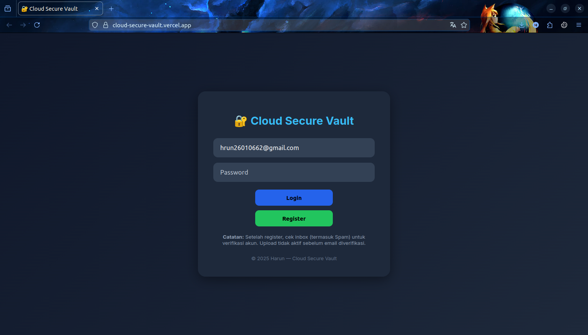

Berikut versi **README.md** yang lebih profesional dan ringkas, siap untuk GitHub, lengkap dengan badge, link Supabase, dan instruksi deployment:

# 🔐 Cloud Secure Vault

[](LICENSE)
[](https://supabase.com/)

Cloud Secure Vault adalah aplikasi web untuk menyimpan file **aman di cloud** dengan enkripsi AES. Pengguna dapat mendaftar, login, upload file terenkripsi, dan mengunduh file dengan kunci rahasia pribadi mereka.

---

## Fitur Utama

- ✅ Registrasi & login dengan **email & password**.
- ✅ Verifikasi email sebelum upload.
- ✅ Enkripsi file dengan **AES**.
- ✅ Penyimpanan file di **Supabase Storage**.
- ✅ Daftar file yang sudah diupload + tombol download.
- ✅ Dekripsi file saat download menggunakan **kunci rahasia**.
- ✅ Responsif untuk desktop & mobile.

---

## Demo / Screenshot

  
*Contoh tampilan aplikasi.*

---

## Teknologi

- **Frontend:** HTML, CSS, JavaScript  
- **Library:** 
  - [Supabase JS](https://supabase.com/docs/reference/javascript/introduction) — autentikasi & storage  
  - [CryptoJS](https://cryptojs.gitbook.io/docs/) — AES enkripsi/dekripsi  
- **Backend:** Supabase (Auth + Storage)  
- **Hosting:** Netlify / Vercel / localhost  

---

## Cara Menjalankan

1. Clone repository:
   git clone <repository-url>
   cd cloud-secure-vault
   

2. Buka `index.html` di browser atau jalankan server lokal:

   npx http-server .


3. Buat akun di [Supabase](https://supabase.com/) dan buat project baru.

4. Buat **Storage Bucket** bernama: `secure-files`.

5. Update `app.js` dengan URL & API Key Supabase:

   const supabase = createClient("SUPABASE_URL", "SUPABASE_ANON_KEY");

6. Akses aplikasi dan lakukan:

   * Registrasi akun
   * Login
   * Upload file dengan kunci rahasia
   * Download & masukkan kunci untuk dekripsi

---

## Struktur Folder

```
cloud-secure-vault/
├─ index.html        # Halaman utama
├─ style.css         # Styling
├─ app.js            # Script frontend
├─ README.md         # Dokumentasi
└─ screenshot.png    # Contoh tampilan
```

---

## Cara Kerja

1. **Registrasi & Login:** Email diverifikasi sebelum upload.
2. **Upload File:** File dienkripsi AES → diubah ke base64 → diupload ke Supabase Storage.
3. **Download & Dekripsi:** Pengguna memasukkan kunci rahasia → file diunduh & didekripsi di browser.

---

## Keamanan

* Kunci enkripsi **tidak disimpan di server**.
* Supabase menyimpan file dalam **format terenkripsi**.
* Kehilangan kunci = file **tidak dapat didekripsi**.

---

## Lisensi

MIT License © 2025 Harun
